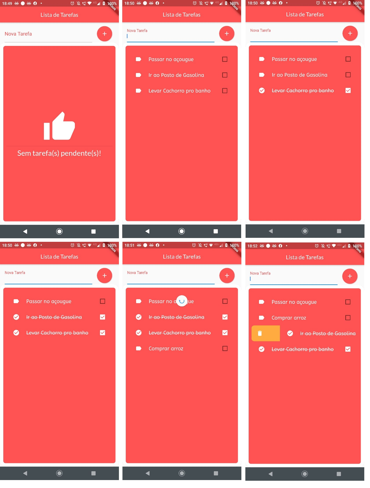

# Lista de Tarefas

Lista de tarefas desenvolvido em *flutter* utilizando a linguagem *dart*

## Principal Funcionalidade
Armazenamento e Recuperação de Informações em arquivo no formato _json_.

## Screenchots

### Widgets
 - CheckboxListTile https://api.flutter.dev/flutter/material/CheckboxListTile-class.html
 - BoxDecoration https://api.flutter.dev/flutter/painting/BoxDecoration-class.html
 - SnackBar https://api.flutter.dev/flutter/material/SnackBar-class.html
 - CircleAvatar https://api.flutter.dev/flutter/material/CircleAvatar-class.html
 - Dismissible https://api.flutter.dev/flutter/widgets/Dismissible-class.html
 - RefreshIndicator https://api.flutter.dev/flutter/material/RefreshIndicator-class.html
 - Future (*async* e *await*) https://api.flutter.dev/flutter/dart-async/Future-class.html
 - Scaffold https://api.flutter.dev/flutter/material/Scaffold-class.html

### Recursos Extras
 - PathProvider https://pub.dev/packages/path_provider
 - GoogleFonts https://pub.dev/packages/google_fonts
